# TC23SC cells

Pin numbers use the canonical cell orientation. Images show top metal on the left and polysilicon on the right.

## Inverter (h2_0)

```text
p0 = ~p1
```

| Pin index | Direction | Signal |
| --- | --- | --- |
| 0 | Output | y |
| 1 | Input | a |

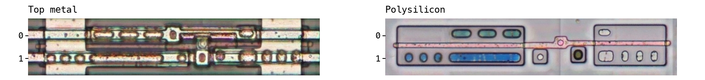

## Logic ties (h2_1)

```text
p0 = 1'b0
p1 = 1'b1
```

| Pin index | Direction | Signal |
| --- | --- | --- |
| 0 | Output | gnd |
| 1 | Output | vcc |

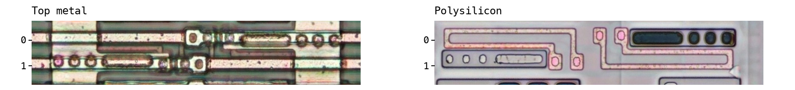

## 2-input NOR gate (h3_0)

```text
p1 = ~(p0 | p2)
```

| Pin index | Direction | Signal |
| --- | --- | --- |
| 0 | Input | a |
| 1 | Output | y |
| 2 | Input | b |

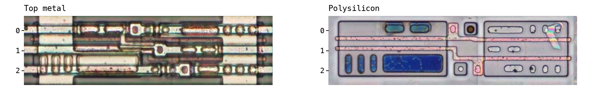

## Buffer (h3_1)

```text
p0 = p1
```

| Pin index | Direction | Signal |
| --- | --- | --- |
| 0 | Output | y |
| 1 | Input | a |

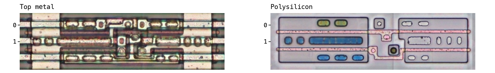

## 2-input NAND gate (h3_2)

```text
p1 = ~(p0 & p2)
```

| Pin index | Direction | Signal |
| --- | --- | --- |
| 0 | Input | a |
| 1 | Output | y |
| 2 | Input | b |

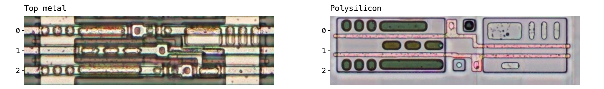

## Inverter (h3_3)

```text
p1 = ~p2
```

| Pin index | Direction | Signal |
| --- | --- | --- |
| 1 | Output | y |
| 2 | Input | a |

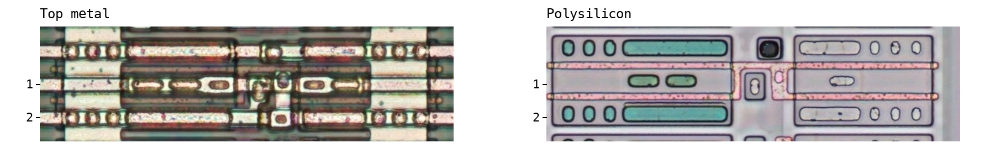

## Inverter (h3_4)

```text
p1 = ~p2
```

| Pin index | Direction | Signal |
| --- | --- | --- |
| 1 | Output | y |
| 2 | Input | a |

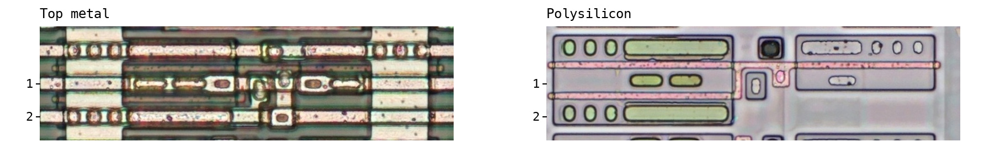

## 3-input NAND gate (h4_0)

```text
p1 = ~(p2 & p0 & p3)
```

| Pin index | Direction | Signal |
| --- | --- | --- |
| 0 | Input | b |
| 1 | Output | y |
| 2 | Input | a |
| 3 | Input | c |

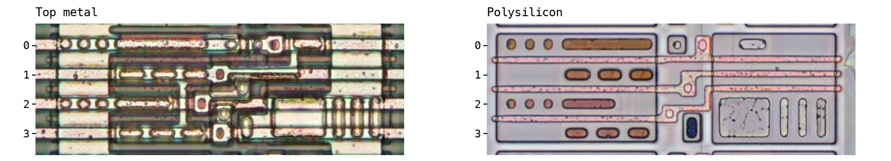

## 3-input AND gate (h4_1)

```text
p0 = p1 & p2 & p3
```

| Pin index | Direction | Signal |
| --- | --- | --- |
| 0 | Output | y |
| 1 | Input | a |
| 2 | Input | b |
| 3 | Input | c |

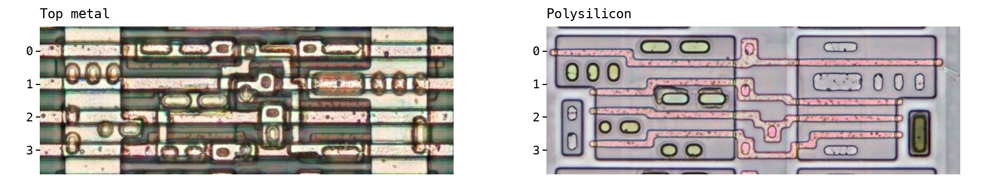

## 2-input AND gate (h4_2)

```text
p3 = p0 & p1
```

| Pin index | Direction | Signal |
| --- | --- | --- |
| 0 | Input | a |
| 1 | Input | b |
| 3 | Output | y |

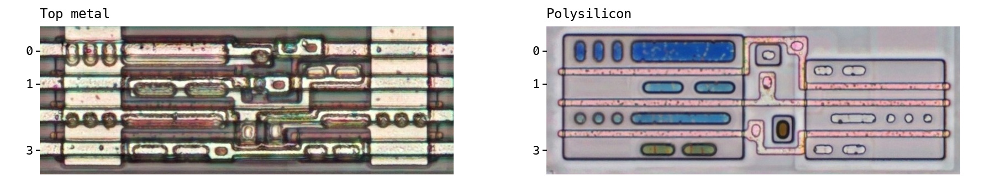

## 2-input OR gate (h4_3)

```text
p3 = p0 | p2
```

| Pin index | Direction | Signal |
| --- | --- | --- |
| 0 | Input | a |
| 2 | Input | b |
| 3 | Output | y |

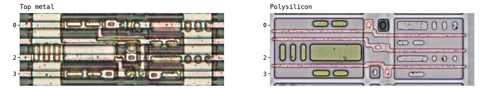

## AND-OR-Invert gate (AOI21) (h4_4)

```text
p2 = ~((p1 & p3) | p0)
```

| Pin index | Direction | Signal |
| --- | --- | --- |
| 0 | Input | c |
| 1 | Input | a |
| 2 | Output | y |
| 3 | Input | b |

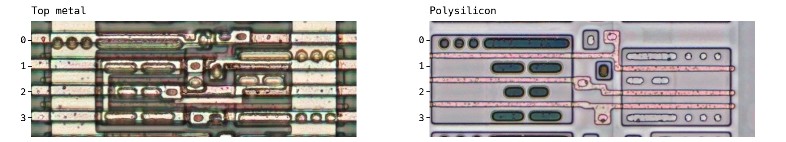

## Inverting driver (h4_5)

```text
p2 = ~p1
```

| Pin index | Direction | Signal |
| --- | --- | --- |
| 1 | Input | a |
| 2 | Output | y |

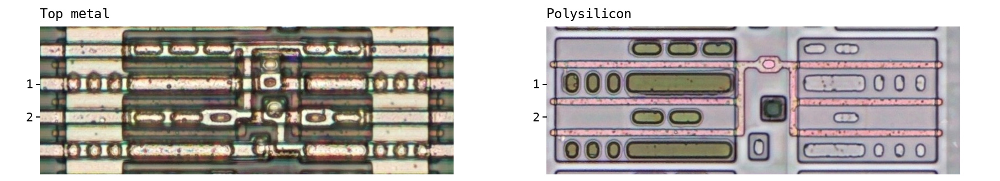

## NAND gate with one inverted input (h4_6)

```text
p1 = ~(p0 & ~p3)
```

| Pin index | Direction | Signal |
| --- | --- | --- |
| 0 | Input | b |
| 1 | Output | y |
| 3 | Input | a |

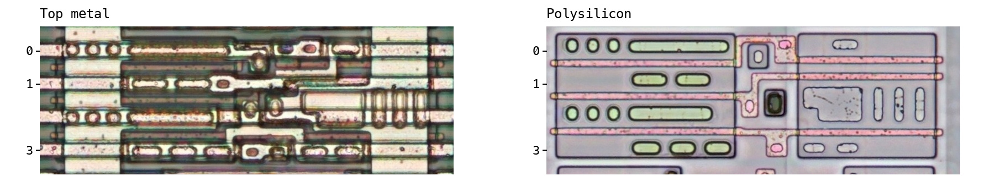

## 3-input NOR gate (h4_7)

```text
p1 = ~(p0 | p2 | p3)
```

| Pin index | Direction | Signal |
| --- | --- | --- |
| 0 | Input | a |
| 1 | Output | y |
| 2 | Input | b |
| 3 | Input | c |

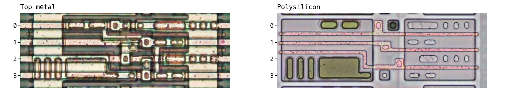

## NOR gate with one inverted input (h4_8)

```text
p1 = ~p0 & p3
```

| Pin index | Direction | Signal |
| --- | --- | --- |
| 0 | Input | p0 |
| 1 | Output | y |
| 2 | NC | p2 |
| 3 | Input | p3 |

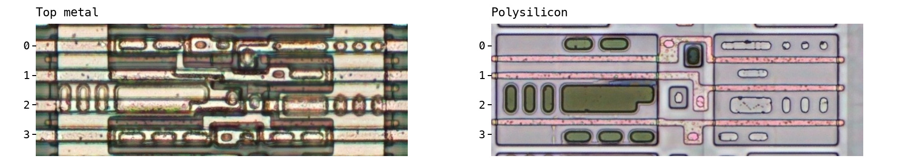

## Transparent-low D latch (h5_0)

```text
while p4 == 0:
    p0 = p3
otherwise:
    hold p0
```

| Pin index | Direction | Signal |
| --- | --- | --- |
| 0 | Output | q |
| 3 | Input | d |
| 4 | Input | en_n |

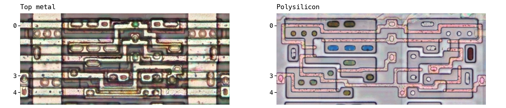

## Transparent-high D latch (h5_1)

```text
while p4 == 1:
    p0 = p2
otherwise:
    hold p0
```

| Pin index | Direction | Signal |
| --- | --- | --- |
| 0 | Output | q |
| 2 | Input | d |
| 4 | Input | en |

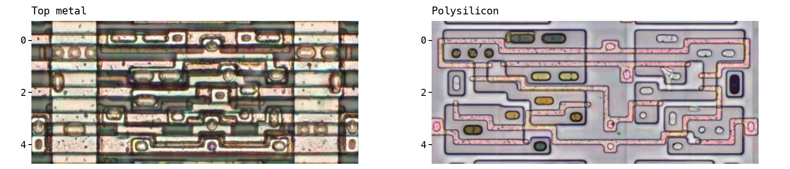

## Inverter (h5_2)

```text
p1 = ~p3
```

| Pin index | Direction | Signal |
| --- | --- | --- |
| 1 | Output | y |
| 3 | Input | a |

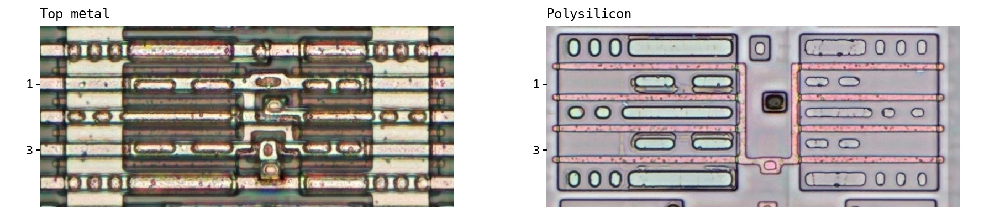

## AND-OR-Invert gate (AOI22) (h5_3)

```text
p2 = ~((p4 & p0) | (p3 & p1))
```

| Pin index | Direction | Signal |
| --- | --- | --- |
| 0 | Input | p0 |
| 1 | Input | p1 |
| 2 | Output | p2 |
| 3 | Input | p3 |
| 4 | Input | p4 |

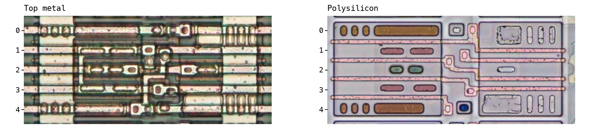

## OR-AND-Invert gate (OAI22) (h5_4)

```text
p2 = ~((p3 | p1) & (p4 | p0))
```

| Pin index | Direction | Signal |
| --- | --- | --- |
| 0 | Input | p0 |
| 1 | Input | p1 |
| 2 | Output | y |
| 3 | Input | p3 |
| 4 | Input | p4 |

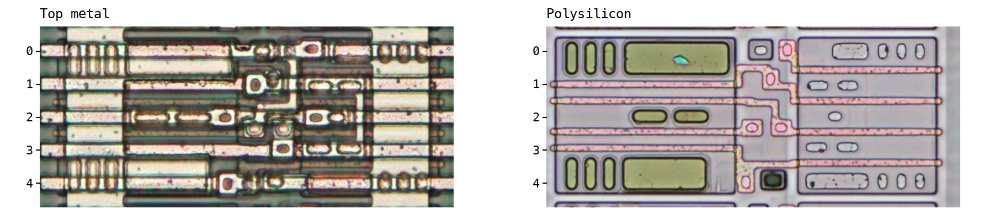

## 4-input AND gate (h5_5)

```text
p4 = p0 & p1 & p2 & p3
```

| Pin index | Direction | Signal |
| --- | --- | --- |
| 0 | Input | a |
| 1 | Input | b |
| 2 | Input | c |
| 3 | Input | d |
| 4 | Output | y |

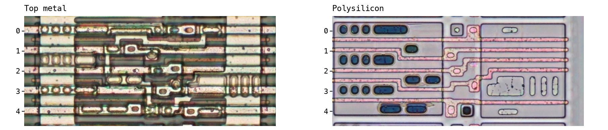

## Inverting 2:1 multiplexer (h5_6)

```text
p3 = ~(p0 ? p1 : p4)
```

| Pin index | Direction | Signal |
| --- | --- | --- |
| 0 | Input | sel |
| 1 | Input | a |
| 3 | Output | y |
| 4 | Input | b |

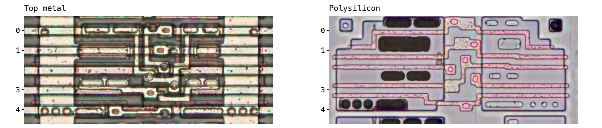

## 2:1 multiplexer (h6_0)

```text
p5 = p0 ? p1 : p4
```

| Pin index | Direction | Signal |
| --- | --- | --- |
| 0 | Input | sel |
| 1 | Input | a_sel1 |
| 4 | Input | b_sel0 |
| 5 | Output | y |

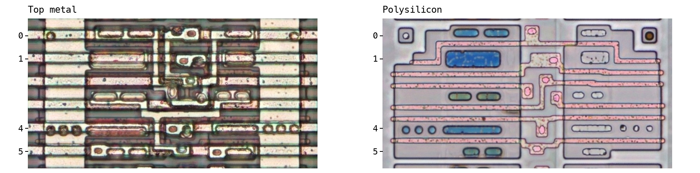

## AND-OR gate (AO22) (h6_1)

```text
p0 = (p5 & p1) | (p2 & p3)
```

| Pin index | Direction | Signal |
| --- | --- | --- |
| 0 | Output | y |
| 1 | Input | b |
| 2 | Input | c |
| 3 | Input | d |
| 5 | Input | a |

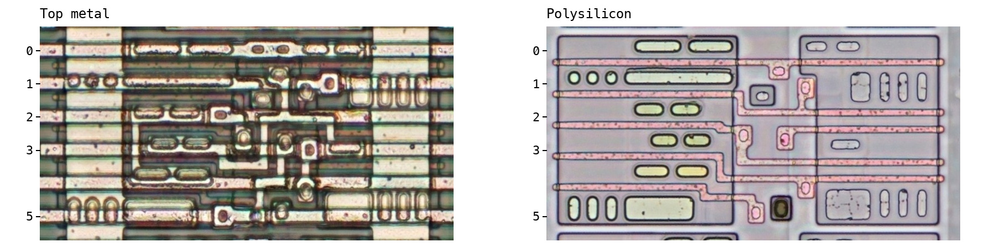

## 2-input XOR gate (h6_2)

```text
p0 = p5 ^ p4
```

| Pin index | Direction | Signal |
| --- | --- | --- |
| 0 | Output | y |
| 4 | Input | b |
| 5 | Input | a |

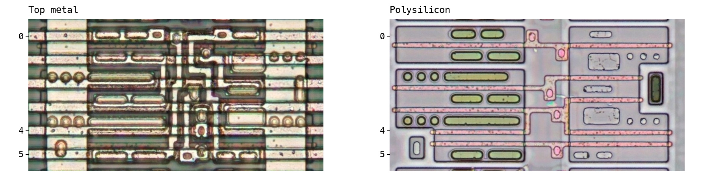

## 2-input XNOR gate (h6_3)

```text
p0 = ~(p5 ^ p4)
```

| Pin index | Direction | Signal |
| --- | --- | --- |
| 0 | Output | y |
| 4 | Input | b |
| 5 | Input | a |

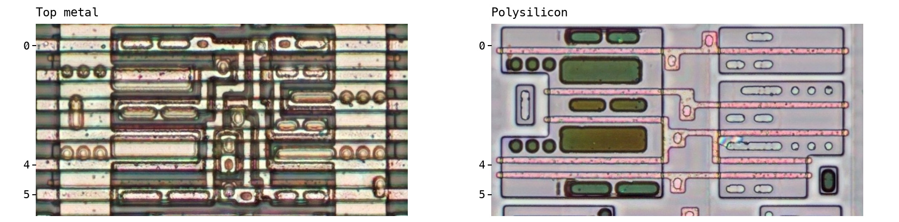

## Transparent-low D latch with asynchronous active-low clear (h6_4)

```text
if p1 == 0:
    p0 = 0
else:
    while p5 == 0:
        p0 = p3
    otherwise:
        hold p0
```

| Pin index | Direction | Signal |
| --- | --- | --- |
| 0 | Output | q |
| 1 | Input | clear_n |
| 3 | Input | data |
| 5 | Input | gate |

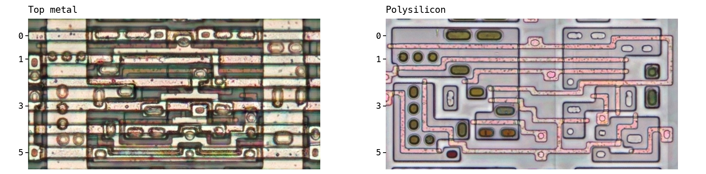

## Rising-edge D flip-flop (h7_0)

```text
on rising edge of p0:
    p6 = p1
otherwise:
    hold p6
```

| Pin index | Direction | Signal |
| --- | --- | --- |
| 0 | Input | clk |
| 1 | Input | d |
| 6 | Output | q |

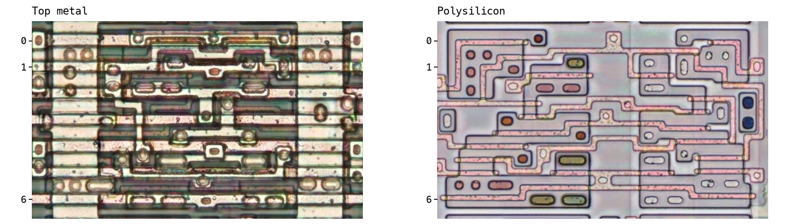

## 6-input NOR gate (h8_0)

```text
p3 = ~(p0 | p2 | p1) & ~(p7 | p6 | p5)
```

| Pin index | Direction | Signal |
| --- | --- | --- |
| 0 | Input | p0 |
| 1 | Input | p1 |
| 2 | Input | p2 |
| 3 | Output | p3 |
| 4 | NC | p4 |
| 5 | Input | p5 |
| 6 | Input | p6 |
| 7 | Input | p7 |

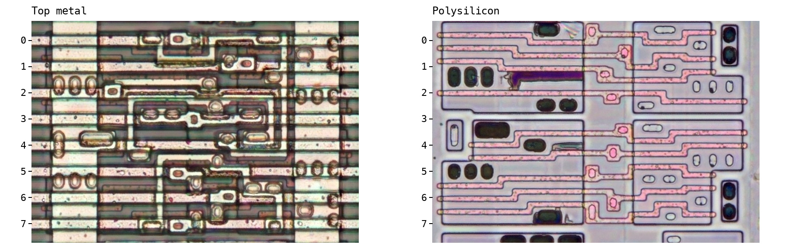

## Rising-edge D flip-flop with asynchronous active-low clear (h9_0)

```text
if p4 == 0:
    p0 = 0
else:
    on rising edge of p8:
        p0 = p7
    otherwise:
        hold p0
```

| Pin index | Direction | Signal |
| --- | --- | --- |
| 0 | Output | q |
| 4 | Input | clear_n |
| 7 | Input | d |
| 8 | Input | clk |

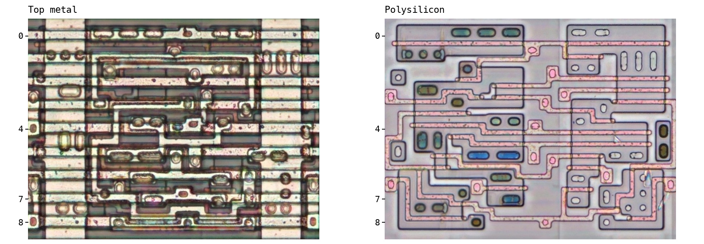

## Rising-edge D flip-flop with asynchronous active-low set (h9_1)

```text
if p7 == 0:
    p8 = 1
else:
    on rising edge of p0:
        p8 = p3
    otherwise:
        hold p8
```

| Pin index | Direction | Signal |
| --- | --- | --- |
| 0 | Input | clk |
| 3 | Input | d |
| 7 | Input | set_n |
| 8 | Output | q |

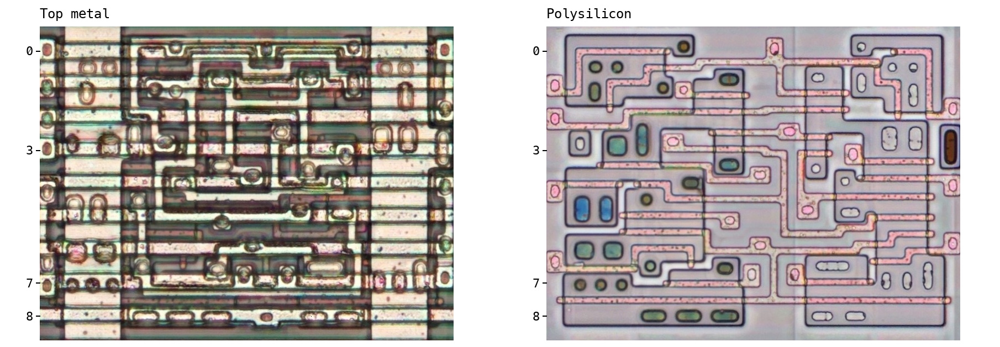

## 6-input NAND gate (h9_2)

```text
p4 = ~(p0 & p1 & p2) | ~(p6 & p8 & p7)
```

| Pin index | Direction | Signal |
| --- | --- | --- |
| 0 | Input | p0 |
| 1 | Input | p1 |
| 2 | Input | p2 |
| 4 | Output | p4 |
| 6 | Input | p6 |
| 7 | Input | p7 |
| 8 | Input | p8 |

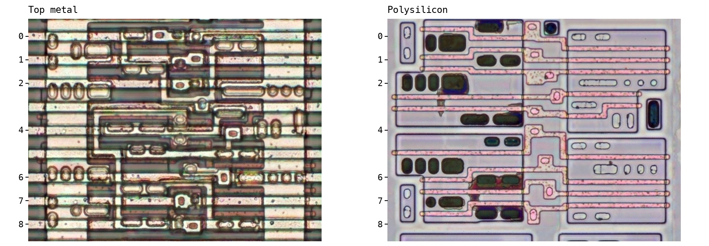

## 4:1 multiplexer (h12_0)

```text
p9 = p10 ? (p1 ? p7 : p5) : (p1 ? p4 : p2)
```

| Pin index | Direction | Signal |
| --- | --- | --- |
| 1 | Input | sel0 |
| 2 | Input | d0 |
| 4 | Input | d1 |
| 5 | Input | d2 |
| 7 | Input | d3 |
| 9 | Output | y |
| 10 | Input | sel1 |

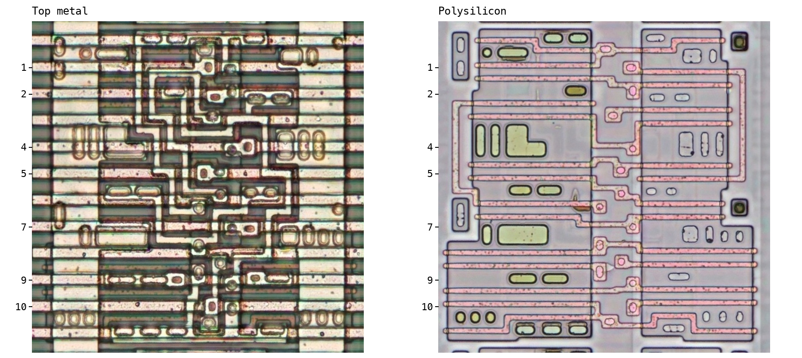

## Ten-inverter delay chain (h20_0)

```text
value = p19
repeat 10 times:
    value = NOT value
p0 = value
```

| Pin index | Direction | Signal |
| --- | --- | --- |
| 0 | Output | p0 |
| 19 | Input | p19 |

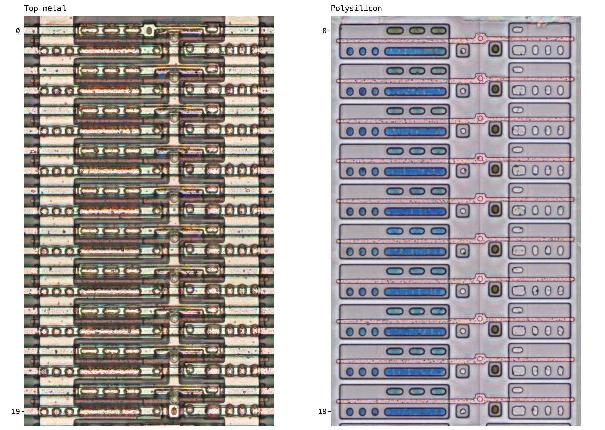

## 8:1 multiplexer with select buffers (h32_0)

```text
p13 = p31 ? (p28 ? (p0 ? p12 : p8) : (p0 ? p3 : p7)) : (p28 ? (p0 ? p16 : p20) : (p0 ? p25 : p21))
p14_left = ~p31
p14_right = p31
p30_left = ~p31
p30_right = p31
```

| Pin index | Direction | Signal |
| --- | --- | --- |
| 0 | Input | select0 |
| 3 | Input | data5 |
| 7 | Input | data4 |
| 8 | Input | data6 |
| 12 | Input | data7 |
| 13 | Output | selected_data |
| 14_left | Output | 14_left |
| 14_right | Output | 14_right |
| 16 | Input | data3 |
| 20 | Input | data2 |
| 21 | Input | data0 |
| 25 | Input | data1 |
| 28 | Input | select1 |
| 30_left | Output | 30_left |
| 30_right | Output | 30_right |
| 31 | Input | select2 |

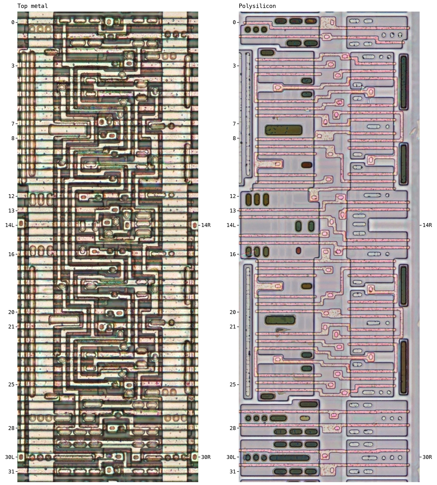

## 4-bit adder (h52_0)

```text
{p51,p50,p37,p24,p11} = {0,p39,p26,p13,p0} + {0,p41,p28,p15,p2} + p1
```

| Pin index | Direction | Signal |
| --- | --- | --- |
| 0 | Input | a0 |
| 1 | Input | cin |
| 2 | Input | b0 |
| 11 | Output | s0 |
| 13 | Input | a1 |
| 15 | Input | b1 |
| 24 | Output | s1 |
| 26 | Input | a2 |
| 28 | Input | b2 |
| 37 | Output | s2 |
| 39 | Input | a3 |
| 41 | Input | b3 |
| 50 | Output | s3 |
| 51 | Output | cout |

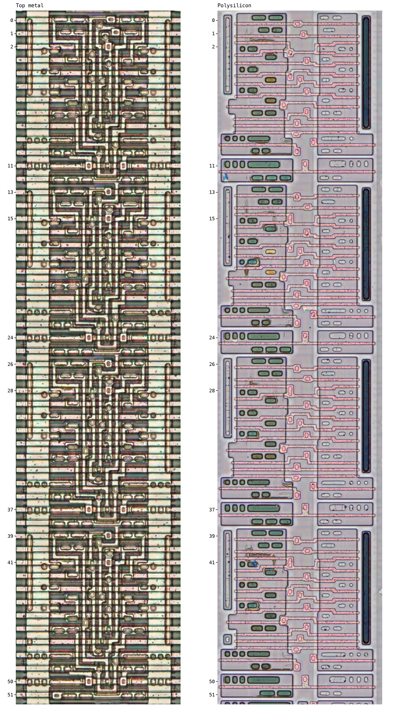
